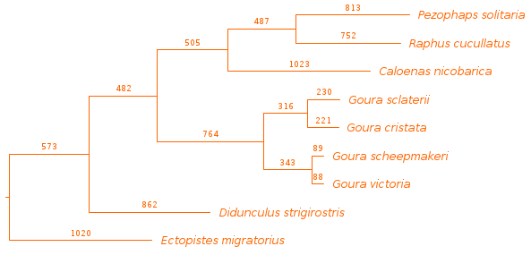

<h1 align="center">PUBLIC CROWN PIGEON GENOMES</h1>

This project focuses on the genomic analysis of crown pigeons (genus *Goura*), employing historical and contemporary specimens to investigate their evolutionary history and current genetic subdivision. Through detailed genomic comparison, we aim to address gaps in our understanding of these species' geographical distribution and foremost, to illustrate the insights that can be gained from public data using open source software.

### HIGHLIGHTS
- **Geographical and Temporal Sampling Analysis**: We've identified significant gaps in the genomic sampling of crown pigeons, which has so far been contigent on specimen collection. This analysis lays out the historical context of future sampling schemes.
- **Phylogenetic Analysis**: By placing mitogenomes phylogenetically we visualize the evolutionary context of crown pigeons and identify a case of geographical subdivision wihtin *Goura sclaterii*.

### VISUAL DOCUMENTATION

*Figure 1: Maximum parsimony tree based on full mitochondrial genomes of the reference species of the species included in the analysis.*

    

*Figure 2: Timeline of specimen collection of crown pigeons, including the specimens of the related Nicobar pigoen (Caloenas nicobarica) and critically endangered tooth-billed pigeon (Didunculus strigirostris).*

    

*Figure 3: Map of New Guinea depicting the four greater regions of crown pigoen specimen origin, corresponding in color to the points on the timeline in Figure 2.*

    

*Figure 4: Detailed depiction of time-stamped Goura cristata sampling sites, including the oldest of the specimen included in the dataset, a Goura cristata collected by Alfred Russell Wallace assistant, Charles Martin Allen on Misool Island in 1860.*

    

*Figure 5: A Consensus tree based on cytochrome b, annotated with sampling year and location of specimens, revealing a subdivision between Goura sclaterii in the western part of New Guinea (Indonesia) and the eastern part (Papua New Guinea)*

### FUTURE DIRECTIONS

By leveraging public datasets and open source software we bridge various sources of data and aim to provide information for future management decisions.

For detailed insights and to explore the source code behind the ongoing project, please visit our [GitHub repository](https://github.com/ljdnielsen/pigeon_conservation/tree/main).

